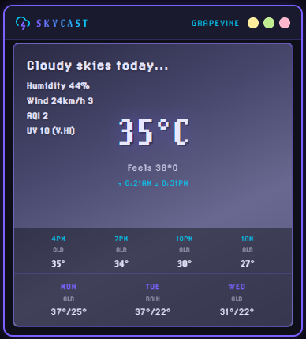

# SKYCAST
**Your sky. Right now.**

A Chrome extension and local web app that delivers real-time weather with hourly and 3-day
forecasts, UV index, air quality, and animated condition scenes — all from a single OpenWeatherMap
API key. Built with vanilla JavaScript, a modular architecture, and a retro pixel-art design system.

---

## Preview



---

## What This Project Demonstrates

- Chrome Extension Manifest V3 architecture (permissions, storage, options page)
- Async JavaScript with `Promise.allSettled` for coordinated multi-source API fetching
- Secure credential management via `chrome.storage.sync` (never hardcoded)
- Environment-aware storage abstraction (extension vs. local dev server)
- Safe DOM construction using `createElement` / `textContent` (no `innerHTML` injection)
- CSS design token system (`--custom-properties`) for maintainable theming
- ARIA roles, live regions, and semantic HTML for accessibility
- Modular code separation: pure logic in `helpers.js`, orchestration in `popup.js`
- Unit-tested helper functions with Jest (37 assertions)
- `prefers-reduced-motion` media query for accessibility

---

## Features

| Feature | Detail |
|---|---|
| Current conditions | Temperature, feels like, humidity |
| Wind | Speed (km/h) + compass direction |
| Air Quality Index | PM2.5-based AQI from OpenWeatherMap |
| UV Index | Real-time index with LOW/MOD/HIGH/V.HI/EXT label |
| Sunrise / Sunset | Local times from API `sys` data |
| Animated scenes | 5 condition-based backgrounds: sunny, cloudy, rainy, night, cold |
| Hourly strip | Next 4 three-hour forecast slots |
| 3-day forecast | Day name, condition label, high/low range |
| Setup overlay | First-run API key prompt with inline validation |
| Settings page | Dedicated options page for key management |

---

## Architecture

```
popup.html          Entry point — semantic HTML, ARIA roles
  ├── helpers.js    Pure functions (weather logic, formatters) — testable with Jest
  └── popup.js      DOM orchestration, API fetching, storage abstraction

options.html        Extension settings page
  └── options.js    API key save/load via Storage abstraction

Storage abstraction
  ├── chrome.storage.sync   (extension context)
  └── localStorage          (local dev server fallback)

OpenWeatherMap APIs (4 concurrent fetches via Promise.allSettled)
  ├── /weather          Current conditions
  ├── /forecast         5-day / 3-hour slots → hourly strip + 3-day row
  ├── /air_pollution    PM2.5 AQI
  └── /uvi              UV index
```

---

## Running the App

### As a local web app

```bash
cd Weather-App
python -m http.server 8000
```

Open `http://localhost:8000/popup.html` in your browser.

On first load, an overlay prompts for your API key. The key is saved to `localStorage` for
subsequent visits.

> Geolocation requires `http://localhost` — opening as a `file://` URL will fail.

### As a Chrome Extension

1. Open Chrome → `chrome://extensions`
2. Enable **Developer mode** (top right)
3. Click **Load unpacked** and select the `Weather-App` folder
4. Click the extension icon → enter your API key when prompted
5. To update the key later: right-click the extension icon → **Options**

---

## API Key Setup

1. Register at [openweathermap.org](https://openweathermap.org/api) (free tier works)
2. Copy your API key from the dashboard
3. Paste it into the setup overlay on first run, or via the Options page

New keys activate within 2 hours of registration.

Your key is stored in `chrome.storage.sync` (extension) or `localStorage` (local dev) —
never hardcoded in source files.

---

## Development

### Run tests

```bash
npm install
npm test
```

Tests cover all pure helper functions in `helpers.js`: wind direction, UV labels, condition
mapping, time formatting, weather condition detection, and weather messages (37 assertions).

### Project structure

```
Weather-App/
├── popup.html          Extension popup UI
├── popup.css           Design system (CSS custom properties + gradient backgrounds)
├── popup.js            DOM orchestration + API fetching
├── helpers.js          Pure helper functions (imported by tests)
├── options.html        API key settings page
├── options.js          Settings page logic
├── options.css         Settings page styles
├── manifest.json       Chrome Extension Manifest V3
├── Animations/         Sprite frames for weather character
├── background/         (legacy static backgrounds — replaced by CSS gradients)
├── fonts/              LoRes pixel fonts
├── icons/              Extension icon
├── tests/
│   └── helpers.test.js Jest test suite
├── package.json        Node dev dependencies (Jest)
└── jest.config.js      Jest configuration
```

---

## Troubleshooting

| Problem | Cause | Fix |
|---|---|---|
| "Failed to load weather" | Invalid or expired API key | Open Options page and update key |
| Setup overlay on every load | API key not saving | Check browser storage permissions |
| Blank popup | Opened as `file://` URL | Use `python -m http.server 8000` |
| Geolocation denied | Browser permission blocked | Click the lock icon in the address bar → allow location |
| No UV data | `/uvi` endpoint subscription required | UV row will simply stay blank — all other data loads |
| Animation not moving | `prefers-reduced-motion` enabled | By design — respects system accessibility setting |

---

## Stack

| Layer | Technology |
|---|---|
| Runtime | Vanilla JavaScript (ES2022), no framework |
| Extension API | Chrome Manifest V3, `chrome.storage.sync` |
| Weather data | OpenWeatherMap REST API v2.5 |
| Styling | CSS custom properties, CSS gradients, `backdrop-filter` |
| Typography | LoRes pixel fonts (LoRes12, LoRes15) |
| Testing | Jest 29, Node test environment |
| CI | GitHub Actions |
